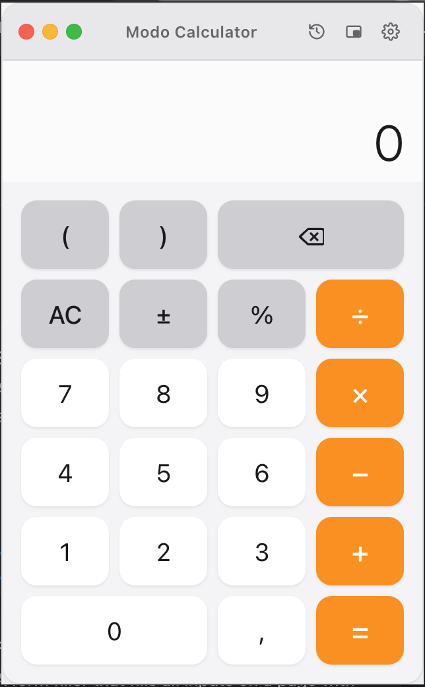
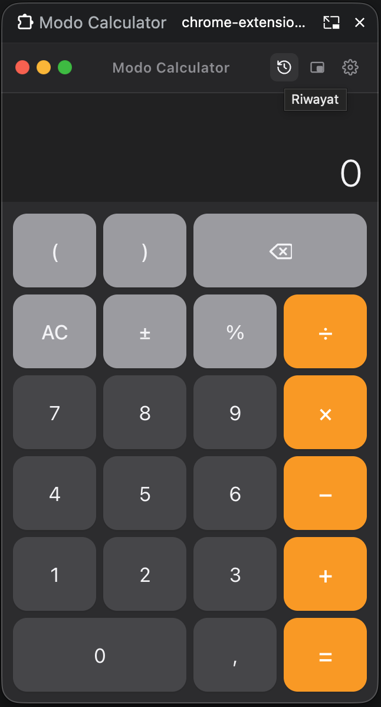
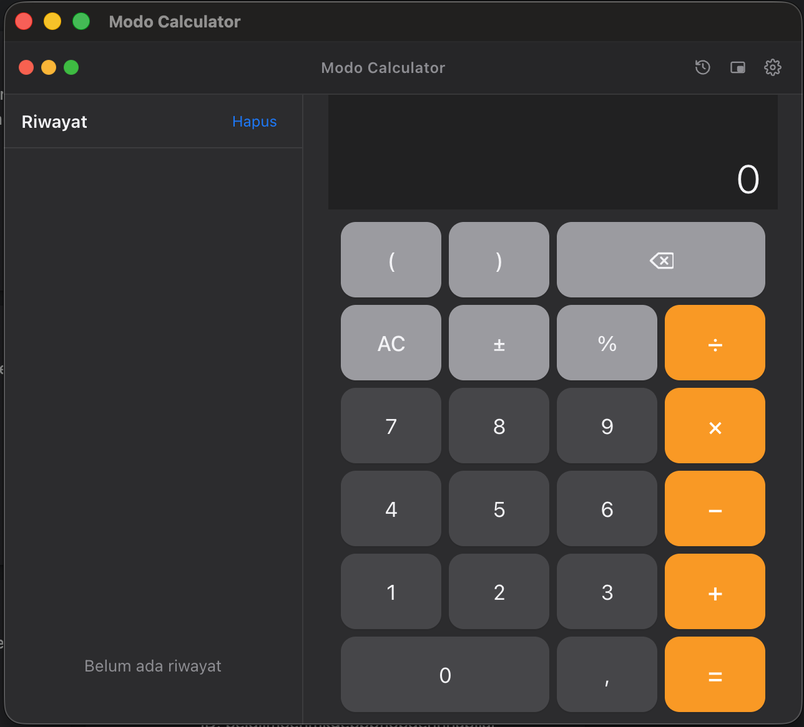

# Modo Calculator

[](LICENSE)
[](https://www.google.com/chrome/)
[](#development)

Kalkulator Chrome Extension bergaya macOS dengan smart paste, format region, history, dan mode **Picture-in-Picture** (always-on-top di atas semua aplikasi).

> **Note:** UI saat ini full Bahasa Indonesia. PR untuk i18n (`chrome.i18n`) sangat diterima.

|              Popup (light)              |     Picture-in-Picture (dark)     |
| :-------------------------------------: | :-------------------------------: |
|  |  |



## Fitur

- **Ekspresi penuh** — kurung, operator precedence, parser shunting-yard (tanpa `eval`, aman dari injection).
- **Smart paste** — tekan <kbd>Cmd/Ctrl + V</kbd> angka dari mana saja, format region otomatis terdeteksi:
  - `1,234.56` (US) · `1.234,56` (ID/EU) · `1 234,56` (FR dengan non-breaking space dari Excel)
  - Mata uang: `Rp 1.000`, `$1,234.56`, `€`, `£`, `¥`, `₹`, dll.
  - Persen: `50%` → `0.5`
  - Scientific: `1.5e3` → `1500`
  - Akuntansi negatif: `(1,234)` → `-1234`
- **Excel multi-cell sum** — paste beberapa sel (tab/newline) dan kalkulator menjumlahkan otomatis.
- **Live preview** — hasil ekspresi sementara muncul dim di atas hasil final saat mengetik.
- **History** — 100 kalkulasi terakhir, klik untuk restore hasil. Di viewport ≥560px muncul sebagai sidebar.
- **Settings** — pilih pemisah ribuan/desimal (ID/US/FR/bare), tema auto/light/dark, toggle smart paste dan multi-cell sum.
- **Picture-in-Picture** — window kecil yang tetap di atas semua aplikasi lain (butuh Chrome 116+).
- **State persistence** — ekspresi yang sedang ditulis tidak hilang saat popup ditutup.
- **Keyboard-friendly** — semua tombol punya binding keyboard.

## Instalasi

### Dari source (developer mode)

1. Clone repo ini:
   ```sh
   git clone https://github.com/<your-username>/modo-calculator.git
   ```
2. Buka `chrome://extensions` di Chrome.
3. Aktifkan **Developer mode** (pojok kanan atas).
4. Klik **Load unpacked** → pilih folder hasil clone.
5. Pin icon Modo Calculator di toolbar untuk akses cepat.

**Minimum Chrome:** 116 (dibutuhkan untuk `documentPictureInPicture` API).

### Chrome Web Store

Belum tersedia.

## Keyboard shortcuts

| Key              | Aksi                        |
| :--------------- | :-------------------------- |
| `0`–`9`          | Input digit                 |
| `.` / `,`        | Desimal                     |
| `+` `-` `*` `/`  | Operator                    |
| `(` `)`          | Kurung                      |
| `Enter` / `=`    | Hitung                      |
| `Escape`         | Clear (AC)                  |
| `Backspace`      | Hapus digit/token terakhir  |
| `%`              | Persen (bagi 100)           |
| `Cmd/Ctrl + V`   | Smart paste                 |

## Mode Picture-in-Picture

Klik tombol PiP di title bar untuk membuka kalkulator di window terpisah:

1. **Klik pertama (dari popup extension):** membuka kalkulator di window popup terpisah — tidak akan tertutup saat klik di luar.
2. **Klik kedua (dari window terpisah):** mengaktifkan Real PiP via `documentPictureInPicture` — kalkulator melayang di atas semua aplikasi lain, termasuk fullscreen video.

## Development

Project ini vanilla JavaScript murni — **tanpa build step, tanpa bundler, tanpa dependency runtime**.

```
manifest.json        Chrome Extension Manifest V3
popup.html           Entry UI
popup.css            Styling (macOS-inspired, dark/light/auto)
calc-core.js         Pure logic: parser, evaluator, formatter (testable)
popup.js             DOM / events / storage / PiP wiring
icons/
  generate_icons.py  Pure-Python icon generator (no PIL)
  icon16/48/128.png
tests/
  calc-core.test.js  Unit tests via node:test
```

### Testing

Gunakan `node:test` built-in (Node 20+), tidak butuh install apapun:

```sh
node --test tests/calc-core.test.js
```

Test mencakup `calc-core.js` — formatter region, evaluator shunting-yard, smart paste parser (semua format region, currency, percent, accounting, scientific, ambiguous disambiguation), Excel multi-cell. Untuk perubahan di DOM/Chrome API/PiP, verifikasi manual di Chrome.

### Regenerasi icon

```sh
python3 icons/generate_icons.py
```

### Coding convention

- Fungsi pure (tanpa DOM/Chrome API) → `calc-core.js` supaya bisa di-test.
- Fungsi DOM/state → `popup.js` sebagai thin wrapper yang inject `state.settings`.
- Tokens menyimpan angka kanonik (`.` sebagai desimal); formatting region hanya di render time.

## Kontribusi

PR dan issue dipersilakan. Area yang paling welcome:

- **i18n** — `chrome.i18n` setup dengan English sebagai default.
- **Scientific mode** — sin/cos/log/√/π (parser sudah extensible).
- **Konversi unit / mata uang**.
- **Unary minus setelah `(`** — saat ini `(-5+3)` gagal, butuh tweak di parser.

Sebelum PR:

1. Jalankan test: `node --test tests/calc-core.test.js`.
2. Load unpacked dan tes manual di Chrome (popup + detached window + PiP).

## License

[MIT](LICENSE) © Afzalur Syaref
